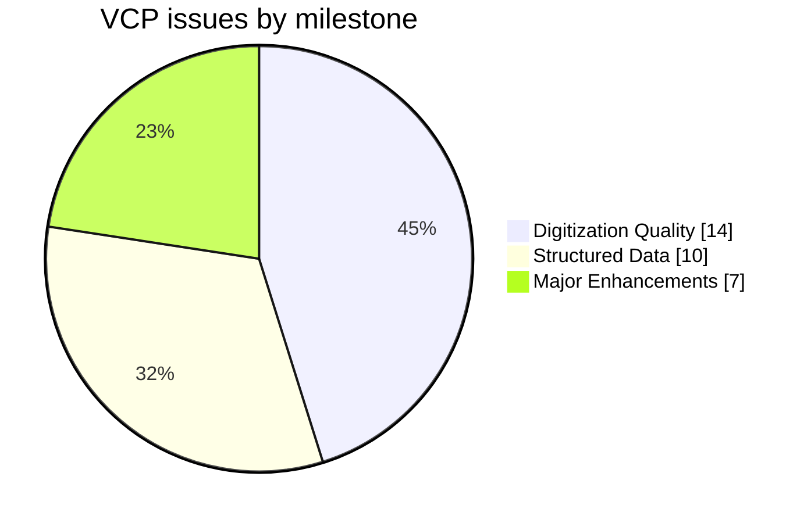
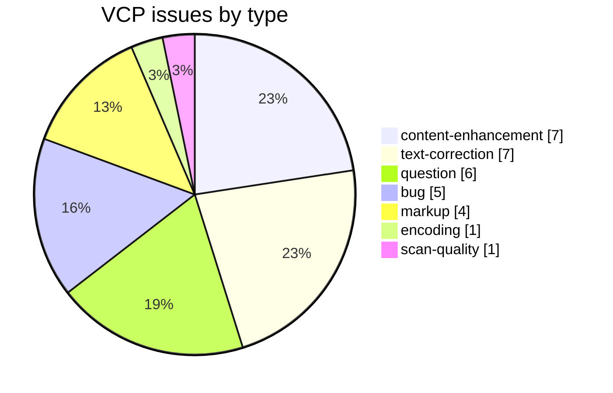
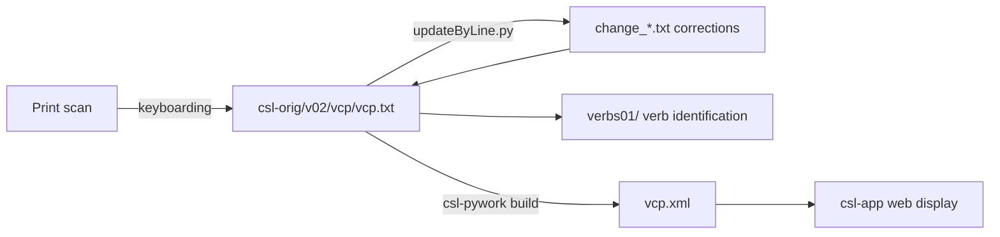

# VCP — *Vācaspatyam* (1873–1884)

Development and correction repository for **Tāranātha Tarkavācaspati's *Vācaspatyam***, a vast indigenous Sanskrit→Sanskrit encyclopedic lexicon, part of the [Cologne Digital Sanskrit Lexicon](https://www.sanskrit-lexicon.uni-koeln.de/) (CDSL). The canonical source text lives in [`csl-orig/v02/vcp/vcp.txt`](https://github.com/sanskrit-lexicon/csl-orig/blob/master/v02/vcp/vcp.txt) (48,636 entries); this repository holds the development, correction, and enrichment work.

An indigenous encyclopaedic dictionary citing authorities through quotations and sigla (e.g. `pu0`, `avya0`) rather than Western `<ls>` markup. This repo also tracks the **VAC (Tirupati)** vs **VCP (Cologne)** edition comparison.

## Documentation

- [CLAUDE.md](CLAUDE.md) — repository guide and data-format reference.
- [DATA_DICTIONARY.md](DATA_DICTIONARY.md) — markup tag reference.
- [CONTRIBUTING.md](CONTRIBUTING.md) · [CODE_OF_CONDUCT.md](CODE_OF_CONDUCT.md)

## Contents

| Path | Purpose |
|---|---|
| `abbrevprep/` | Abbreviation-markup preparation |
| `alternateheadword/` | Alternate-headword extraction |
| `data/` | Working data files |
| `meld_regex/` | Regex rules for `meld` diff comparison |
| `vac-vcp-cmp1/` | VAC (Tirupati) vs VCP (Cologne) comparison |
| `vac-vcp-cmp1a/` | VAC vs VCP comparison (rev.) |
| `vac-vcp-cmp2/` | VAC vs VCP comparison (rev.) |
| `vcpte-vac/` | VCP-TE vs VAC comparison |
| `vcpte-vcp-cmp/` | VCP-TE vs VCP comparison |
| `verbs01/` | Verb identification: maps verb entries to MW roots, with Devanāgarī renderings |

## Timeline

| Period | Activity |
|---|---|
| 2014 | Repository activity begins (first tracked issues) |
| 2015–2021 | Ongoing corrections, markup, and comparison work |
| 2026-05 | Issue taxonomy, citation metadata, documentation |

## Projects & Milestones

| Milestone | Open | Closed | Total |
|---|---|---|---|
| Dictionary to Book | 0 | 0 | 0 |
| Digitization Quality | 6 | 8 | 14 |
| Structured Data | 8 | 2 | 10 |
| Major Enhancements | 6 | 1 | 7 |
| **Total** | **20** | **11** | **31** |

## Issues

### Open

| # | Title | Type | Severity | Milestone |
|---|---|---|---|---|
| 3 | Link to Preface | content-enhancement | medium | Major Enhancements |
| 5 | Vachaspatyam-Doubles | text-correction | minor | Digitization Quality |
| 7 | Progress in alternate headword extraction | markup | minor | Structured Data |
| 9 | All dhatu entries | content-enhancement | medium | Major Enhancements |
| 10 | All Dhatu Entries: verbs01 | content-enhancement | medium | Major Enhancements |
| 11 | abbreviation preparation | markup | minor | Structured Data |
| 12 | vac-vcp-cmp2 | question | minor | Structured Data |
| 14 | VAC (TE) vs. VCP (Cologne) | content-enhancement | medium | Major Enhancements |
| 15 | Meld as a diff viewer for VAC-VCP comparision | question | minor | Structured Data |
| 17 | Suggestions from meta2 | text-correction | minor | Digitization Quality |
| 18 | meld-prep: 'ai'/'au' | encoding | minor | Digitization Quality |
| 19 | vac2a - picture data in TE | bug | minor | Digitization Quality |
| 20 | pUrbb vs. pUrvv | bug | minor | Digitization Quality |
| 22 | Patterns to be handled later | question | minor | Structured Data |
| 23 | Debatable items | question | minor | Structured Data |
| 24 | VAC vs VCP comparision tracker | content-enhancement | medium | Major Enhancements |
| 25 | Query regarding any addenda / corrigenda to Vachaspatyam | question | minor | Structured Data |
| 27 | aNgirAuvAca | markup | minor | Structured Data |
| 29 | Spacing issues in VCP | bug | minor | Digitization Quality |
| 31 | docs-pass: VCP documentation review | content-enhancement | medium | Major Enhancements |

### Solved

| # | Title | Type | Severity | Milestone |
|---|---|---|---|---|
| 1 | Tirupati vs. Cologne Edition Text Comparison | content-enhancement | medium | Major Enhancements |
| 2 | Renaming VCP to VCPTE | question | minor | Structured Data |
| 4 | herasva> heramba | text-correction | minor | Digitization Quality |
| 6 | Tirupati v. Cologne example | text-correction | minor | Digitization Quality |
| 8 | Broken link -- from IITS Koeln home page | bug | minor | Digitization Quality |
| 13 | New VCP scans | scan-quality | minor | Digitization Quality |
| 16 | Correction of {??} missing text in vcp.txt | text-correction | minor | Digitization Quality |
| 21 | print changes pages 34-40 | text-correction | minor | Digitization Quality |
| 26 | print changes 41-50 | text-correction | minor | Digitization Quality |
| 28 | pending 'rbb' in vcp.txt | bug | minor | Digitization Quality |
| 30 | [markup] Minor vcp.txt Markup Oddities | markup | minor | Structured Data |

## Labels

### Type labels

| Label | Meaning |
|---|---|
| `link-target` | Click-throughs from `<ls>` abbreviations to scanned PDF pages |
| `link-splitting` | Splitting combined `SOURCE N,N` refs into per-page links |
| `markup` | Normalising XML tag content |
| `text-correction` | Corrections to Sanskrit/Sanskrit definitions or headwords |
| `content-enhancement` | New material or structural additions beyond correction |
| `encoding` | SLP1/IAST transcoding, character normalisation |
| `scan-quality` | Replacing blurry/skewed/missing scan pages |
| `bug` | Broken links, XML errors, broken downloads |
| `question` | Scholarly questions requiring research |

### Severity labels

| Label | Meaning |
|---|---|
| `minor` | Targeted fix — a handful of lines or a single file |
| `medium` | Standard unit of work — one batch of corrections |
| `hard` | Large effort spanning many sources or files |

## Contributors

| Contributor | Commits |
|---|---|
| drdhaval2785 | 66 |
| funderburkjim | 35 |
| gasyoun (Mārcis Gasūns) | 26 |

## Source

- **Author**: Tarkavācaspati, Tāranātha
- **Title**: *Vācaspatyam*
- **Place / Publisher**: Calcutta
- **Year(s)**: 1873–1884
- **Volumes**: 6 fascicles
- **Language pair**: Sanskrit → Sanskrit
- **Size (CDSL headword index)**: 48,636 entries
- **License (digital edition)**: CC BY-SA 4.0
- See [CITATION.cff](CITATION.cff) for machine-readable citation.

## Encoding

- UTF-8 (NFC) throughout.
- Sanskrit text in SLP1 transliteration, wrapped in `{#…#}`; Sanskrit gloss / italic display text in ``.
- Devanāgarī and IAST display forms are generated at display time, not stored in the source.

## How it works

---
*Issue taxonomy and documentation per the [Cologne issue runbook](https://github.com/sanskrit-lexicon/csl-observatory/blob/main/runbook/cologne-issue-runbook.md).*
